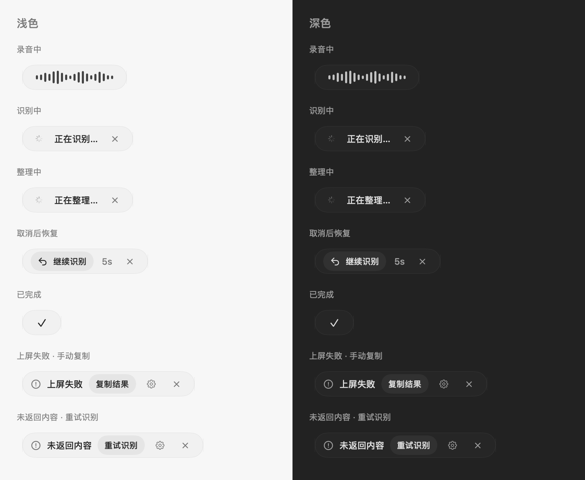
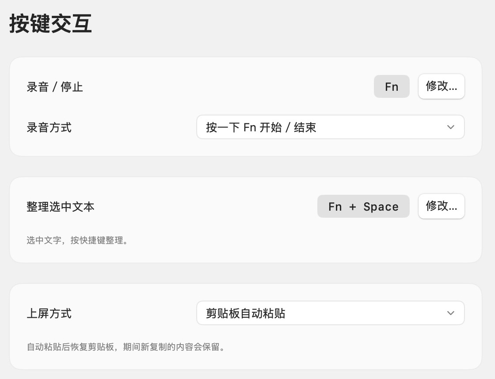
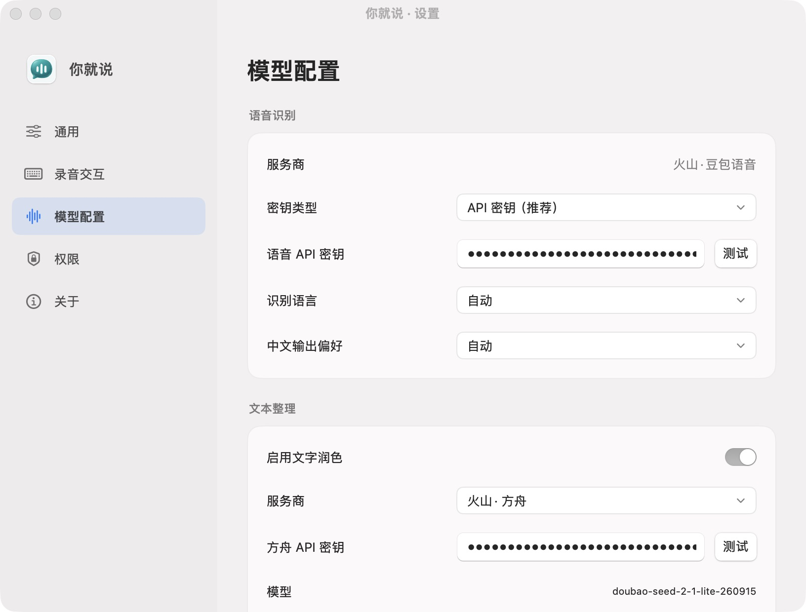
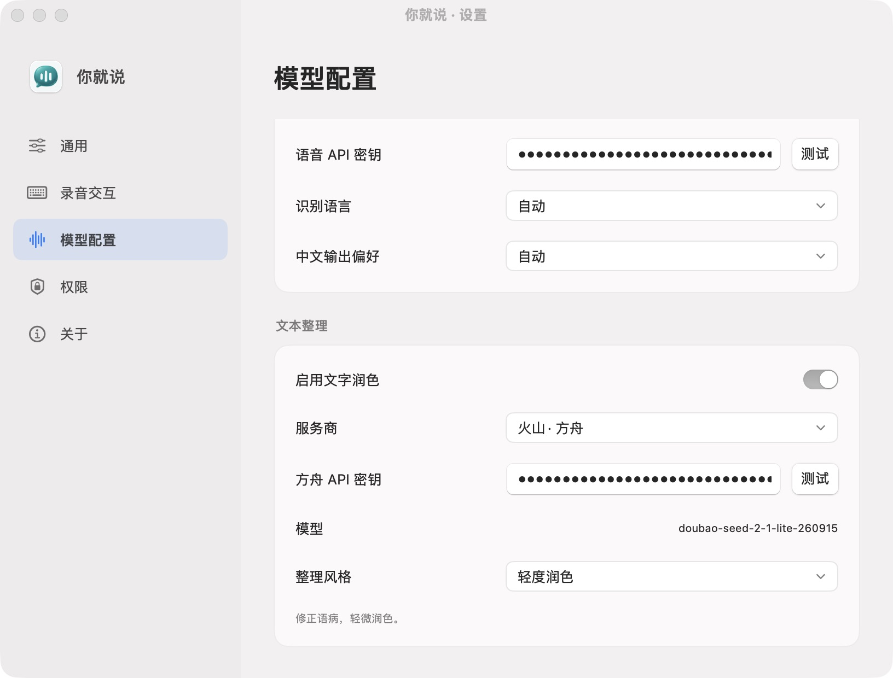

# YouJustSay · 你就说

**极简 macOS 语音输入工具：按 Fn，说话，变成文字。** 支持 macOS 14 及以上。

专注语音输入，按需整理文字。自带 API 密钥，无需注册账号。

## 为什么选择你就说

**功能极简，按量付费，保留你习惯的输入法。**

| 产品 | 为什么你该用你就说 |
| --- | --- |
| [闪电说](https://shandianshuo.cn/docs) | 只想说句话，用不着请个智能体。 |
| [Typeless](https://www.typeless.com/pricing) | 语音输入，何必交月租？API 用多少，付多少。 |
| [OpenTypeless](https://github.com/tover0314-w/opentypeless) | 功能做减法，审美不打折；专注 macOS，把口述输入做好。 |
| [豆包输入法](https://ime.doubao.com/pc) | 五笔、RIME 照用；先开口，再选框，输入工具别改我的习惯。 |

## 界面预览

### 浮条状态

录音、识别、整理、恢复、完成、上屏失败与识别重试，浅色和深色一览。

### 快捷键与上屏

按 Fn 开始／结束，或按住说话。支持自动粘贴、直接键入、仅复制。

### 自带模型密钥

豆包识别语音，方舟整理文字，也支持自定义 OpenAI 兼容整理接口。

### 三种整理风格

基础整理保留原话，轻度润色修正语病，高度结构化分段归类。也可关闭整理。

## 开始使用

1. 打开 `YouJustSay.app`，授权麦克风和辅助功能。
2. 填写豆包语音密钥（录音文件极速版）；启用整理时填写方舟密钥。点击「测试」验证。
3. 按 Fn 说话，再按 Fn 结束，文字输入到所选位置。

按 Esc 取消；识别或整理取消后，5 秒内可恢复。按 `⌃⌥⌘S` 打开设置。

## 数据与隐私

密钥存于本机钥匙串。音频和文字由所选服务处理，不保存文字历史，临时录音正常结束后删除。
